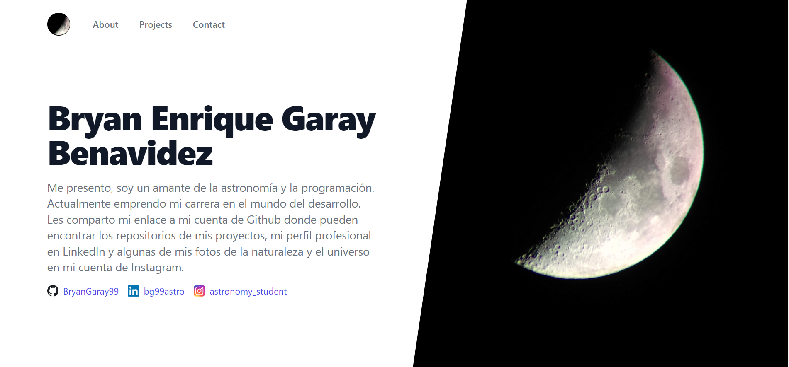

# Proyecto del curso de Asincronismo con JavaScript de Platzi

## Description 
El proyecto consiste en la creación de una landing-page usando primero una plantilla de HTML 
y luego creando un script con JavaScript que contiene un llamado a una API usando los conceptos de asincronismo. 
Adicionalmente se personaliza la plantilla HTML con un estilo y elementos propios. 

## Deploy 
El deploy para tener una url pública se lo realiza usando el paquete de npm gh-pages. Una vez guardado como dev
dependencies, se crea un script en el package.json para correr el comando, en el caso de este proyecto:
"deploy": "gh-pages -d src". Luego vamos a una terminal dentro del proyecto, corremos "npm run deploy" y con eso
el comando buscará un index.html dentro de la carpeta src y creará una rama para deploy de nuestro repositorio del 
proyecto creado previamente en Github. Ingresando a GitHub pages del repositorio de nuestro proyecto, encontraremos 
la url pública. 

En el caso de este proyecto: https://bryangaray99.github.io/Aync-landing-page/

Para actualizar luego de algun cambio se puede volver a correr npm run deploy.

## Vista de la página 
Link: <a href="https://bryangaray99.github.io/Aync-landing-page/" target="_blank" rel="noopener noreferrer">Click Aquí!</a>

  
  
Vista del sitio web

